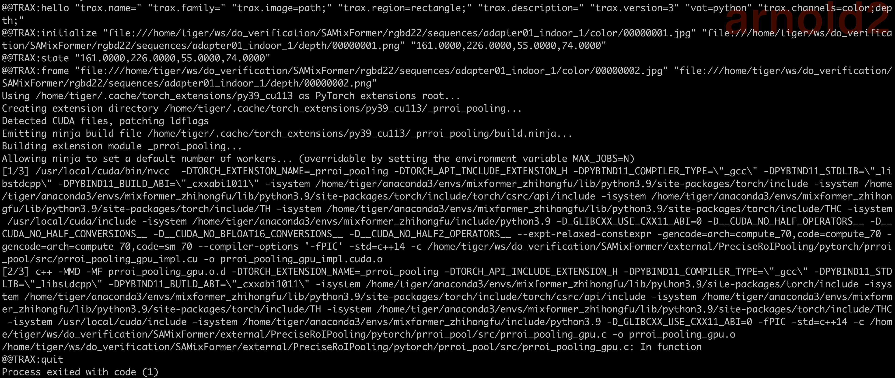

# Requirements

## Hardware Requirements
* GPU: Tesla V100-SXM2-32GB (32 GB memory)
* CPU: Intel(R) Xeon(R) Platinum 8260 CPU @ 2.40GHz
* Memory: 376 GB
* HD: 1.7 TB

## Software Dependency
* OS: Ubuntu 18.04 LTS
* Anaconda 3
* CUDA 11.0, CUDNN 8.2.0
* Python=3.9.13, Pytorch=1.7.1, torchvision=0.8.2 cudatoolkit=10.2, and more...
* gcc 7.4.0, g++ 7.4.0

# Install libraries
```Shell
conda create -n DAMT python=3.7
conda activate DAMT
bash install.sh
```

# Set up the runtime context.
* Step 1: Download the models from Google Drive (Link: https://drive.google.com/file/d/1Tya1nQw4sNHPjGfp170JAUmEXggDbgN2/view?usp=sharing), and put the downloaded package `models.tar.gz` in the root directory of our code.


* Step 2: Decompress the downloaded package `models.tar.gz`. Once done, the directory structure should be the same as the following:
```Shell
DAMTMask
├── README.md
├── VOT2022
├── experiments
├── external
├── models
├── install.sh
├── lib
└── tracking
```

# Run Evaluation
```Shell
cd VOT2022/STS
vot evaluate --workspace $(pwd) DAMTMask
```

# Tips
If you get the same error as pictured below, please rerun the evaluation.


# Contact
If you meet any problem about the environment settings and the code logic, please email <wangliangliang.makalo@bytedance.com> ^_^
